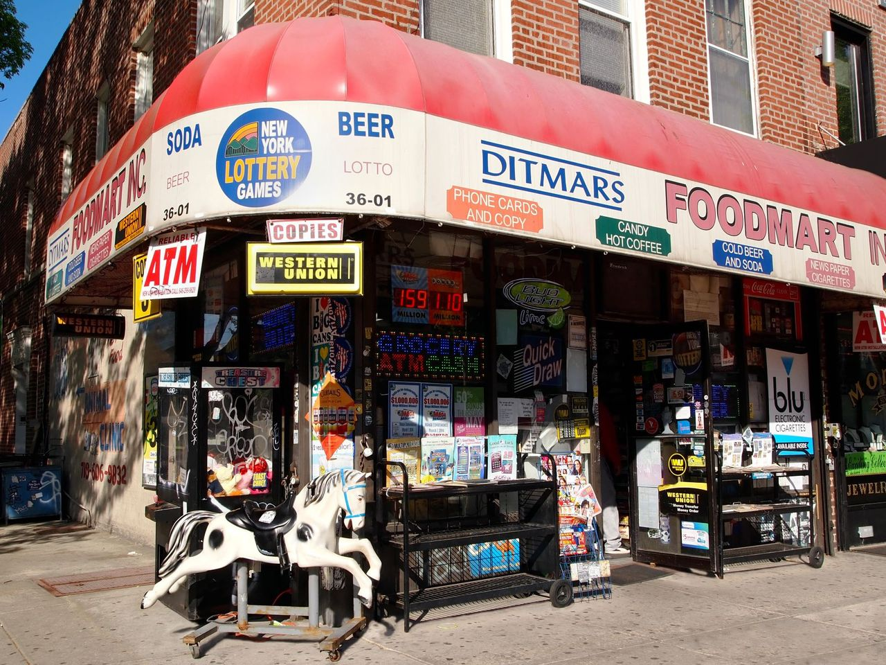
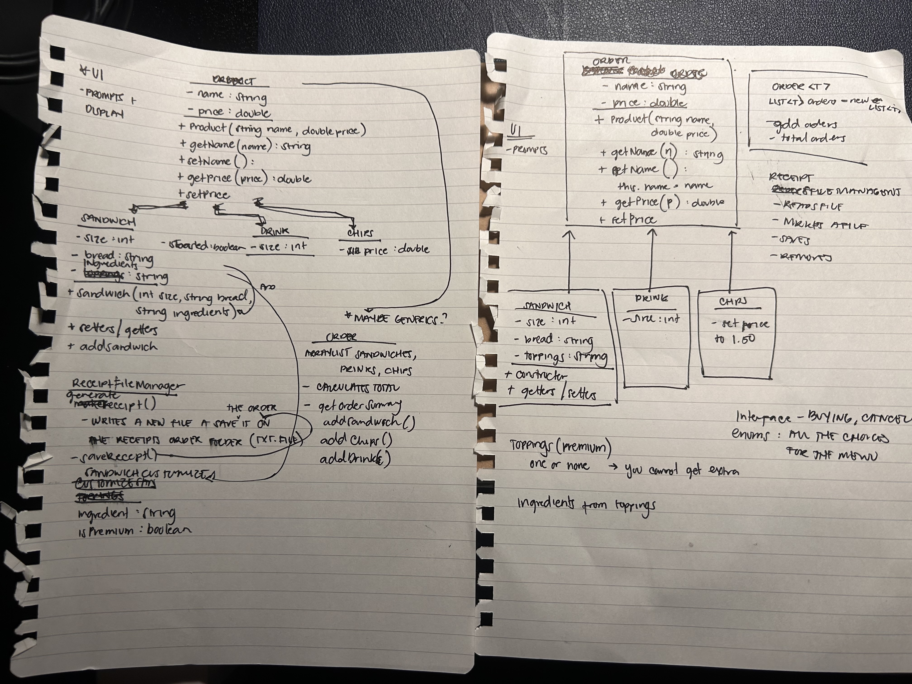
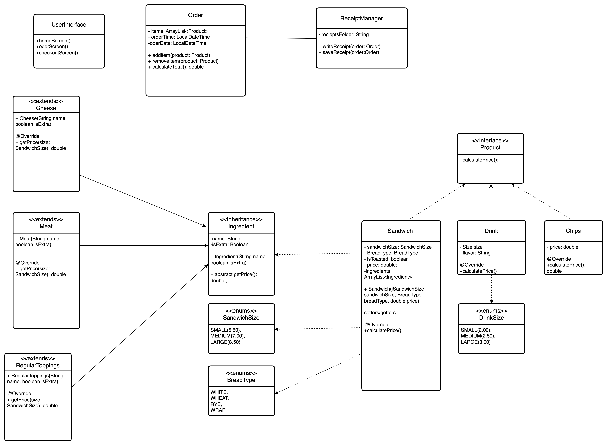
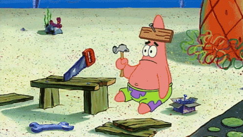
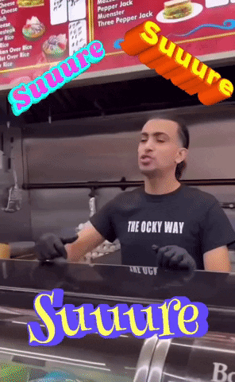

# DELIcious Sandwich shop 24/7 (づ•ᴗ•)づᯓ 🥪

---

## Table of Contents

- [Overview](#Overview)
- [Biggest Challenge](#biggest-challenge)
- [Next steps?](#what-are-the-next-steps)
- [Part/s I am proud of](#parts-i-am-proud-of)
- [About me](#about-me)
- [Resources](#resources)

---

## Overview

**DELI**cious Sandwiches is a JAVA CLI application that allows the customers to order their own customized sandwiches,
drink, and chips!
It also allows the user to confirm, checkout, and cancel the order. When it checks out, it saves the current receipt by
its date and time that way transactions can be tracked and customers can have their own copy!

---

## Biggest Challenge

My biggest challenge in this project is applying OOP concept. Since this is my first time using this approach, it
challenged me how to connect class and its methods, and relationship between the classes.

**Building UML Diagram**

First time making a UML diagram for a project, honestly it's fun to understand this flowchart and a great tool for
structuring the capstone.

**Single Responsibility Principle**

Since this is the first time learning OOP approach, they were tons of gaps that needs to be filled ever since we started
tackling this concept. Thankfully, I have great support system in this class and of course David!


--- 

## What are the next steps...

This capstone gave me more applications I want to do for my side projects. I actually want to continue this capstone on
my free time to apply advance OOP concepts and make it robust and impactful application.

---

## Part/s I am proud of

Honestly... the whole project. Pat on my back(no pun intended!)

- Making a UML diagram. We didn't really go in depth of how to make one, but I was curious, so I made a whole research of
  how to make one and what purpose of each symbol on the list. From making on a paper to making flowcharts how classes
  are related to each other.

### from this




### to this



### to **THIS** 	(☞ﾟヮﾟ)☞


P.S
The final UML could have been done better, but I'm really proud of it!!

- "this" special keyword

  Small detail but one of the things I learned throughout this process is being resourceful and using the resources and
  ACTUALLY UNDERSTANDING it line by line is actually nice to have. One special character I learned is

```java
this
```
this special character is referring the current object being passed in the method parameters. I love learning these small details throughout the process.

- **ENUMS**

At this point my brain is like:



Kidding aside, using enums for the first time as well for the sandwich size, bread type, and drink size.

```java
public enum SandwichSize {
    FOUR_INCH(5.50),
    EIGHT_INCH(7.00),
    TWELVE_INCH(8.50);
    private final double price;

    SandwichSize(double price) {
        this.price = price;
    }

    public double getPrice() {
        return price;
    }
}
```

This way, it made my code more readable and can reuse the values easily.

---
## About me
Hi, I’m Pat Roque, an aspiring software developer passionate about learning and growing in the tech space. With a background in customer experience and leadership, I bring strong communication and problem-solving skills into my development journey. I’m currently focused on Java, building applications and expanding my knowledge of programming fundamentals.

Built with lots of brain cells and mooskels by a developer who takes both their gains and their sandwich making skills seriously (ᕗ ͠° ਊ ͠° )ᕗ ᕙ(⇀‸↼‶)ᕗ 	




---


## Resources

GeeksforGeeks. (2017, March 24). Association, Composition and Aggregation in Java.
GeeksforGeeks. https://www.geeksforgeeks.org/java/association-composition-aggregation-java/

‌
GeeksforGeeks. (2018, August 30). Class Diagram | Unified Modeling Language (UML).
GeeksforGeeks. https://www.geeksforgeeks.org/system-design/unified-modeling-language-uml-class-diagrams/

baeldung. (2019, January 12). Baeldung. Baeldung on Kotlin. https://www.baeldung.com/java-enum-values

‌

---

Huge THANK YOU for all my peers for making difficult days and moments in class better and lighter and lastly David for giving us unending support and LOTS of patience throughout the course. Cheers!

